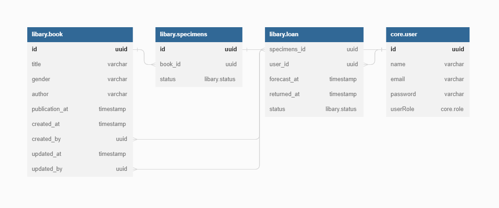

# 📚Libary (Backend)📚

## 📄Description📄

This is my first project with programming, initially it was done in the PHP language, where I started to learn to program, later, I took advantage of the project idea and refactored it in NodeJS, being divided into Backend and Frontend, making use of REST API technology to communication between both, in addition to other technologies and techniques.

## 📇Index📇

- [Settings](/#⚙️Settings⚙️)
- [Run](#🛫Run🛫)
    - [Docker](#🐳Docker🐳)
    - [Docker Compose](#🐳Docker%20Compose🐳)
- [Diagram](#📊Diagram📊)
- [Contributions](#🤝Contributions🤝)

## ⚙️Settings⚙️

To configure the system for its operation, we will rename the example.env file to .env and fill in the following fields:

```bash
# For DB
DB_USER=<DatabaseUser>
DB_PASS=<DatabasePassword>

# For Debug
PGADMIN_EMAIL=<pgAdminEmail>
PGADMIN_PASS=<pgAdminPassword>
```

## 🛫Run🛫

The execution of the project can occur in 3 different ways, manually by command line, compile and run the docker image or run docker compose with all the services, below are the instructions on how to run each mode, remembering that there are environments production and development environments.

### 🐳Docker🐳

To run the docker image, it is necessary to compile and run it according to the instructions below:


```bash
# Generate docker image
~/Libary/backend$ docker build -t <your_user_name>/libary:latest -f (dev or prod).Dockerfile .

# Run the generated image
~/Libary/backend$ docker run -dit --name api-backend <your_user_name>/libary:latest
```

### 🐳Docker Compose🐳

Among the execution modes, docker compose is the simplest to execute, just execute the line below in your command line, remembering that in the --profile field you must pass dev (development) or prod (production) and if you want to start only one service separately, inform which service you want after the -d tag.

```bash
# Start APIs with docker compose
~/Libary$ docker compose --profile (dev or prod) up -d (services)
```

## 📊Diagram📊

The main objective of the project is based on the leasing of books, so the current structure of the database is based on the following domain: the user finds the book he wants and carries out the leasing process, generating a record of that leasing and making the copy unavailable for other temporary locations, the employee (user), registers both a book and its number of copies, below we have a diagram that details how the database will be built, if you want more information, you can access the [diagram](https://dbdocs.io/ThicoMoura/libary) or edit it in the database.dbml file.

<p align="center">
    
</p>

## 🤝Contributions🤝
Contributions are welcome for this project. Feel free to create pull requests to fix bugs, add features, or improve code structure.